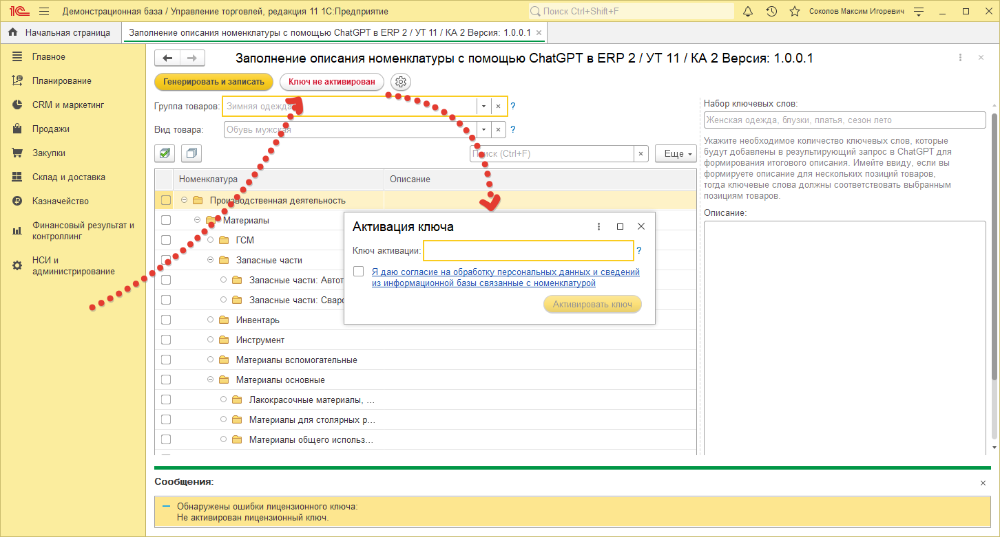
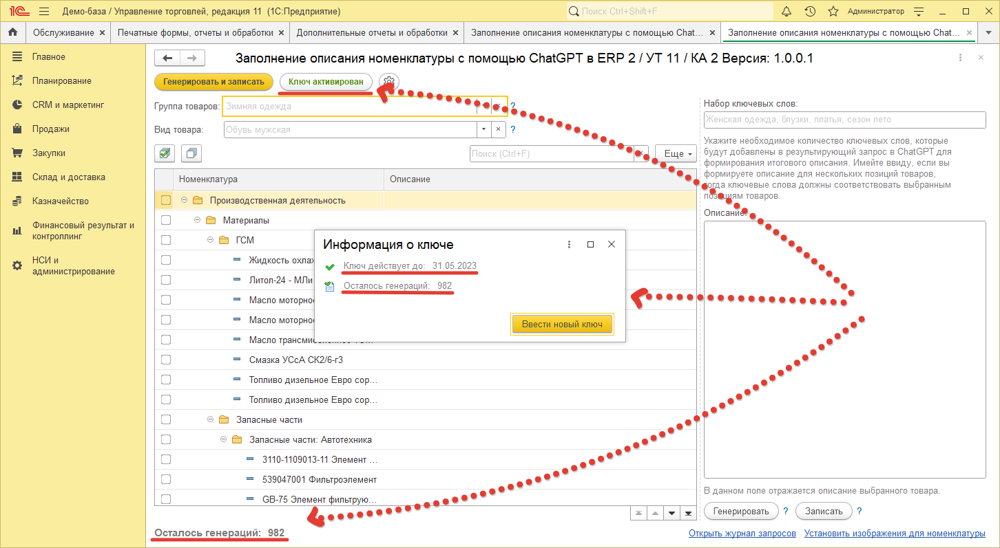

# Активация обработки

Для того чтобы мы могли работать с чатом, нам нужно активировать обработку с помощью ключа и сделать настройки.
Для активации в окне обработки нажмите на кнопку `Ключ не активирован` вверху окна.

> В открывшемся окне введите ключ, который был получен при покупке обработки и нажмите на кнопку `Активировать ключ`.

> После успешной активации надпись на кнопке `Ключ не активирован` сменится на `Ключ активирован`, внизу окна появится количество оставшихся генераций, а в окне активации будет отображаться информация даты окончания действия ключа и так же количества доступных генераций.

!!! Warning Внимание!
Каждый запрос – это одна успешная генерация текста. Полученный после выбора и покупки пакета ключ имеет срок активности в **два месяца** с момента приобретения, по истечению которого доступ к возможностям обработки становится не доступным. В связи с этим в течении этого срока необходимо использовать весь лимит запросов купленного пакета.
!!!

