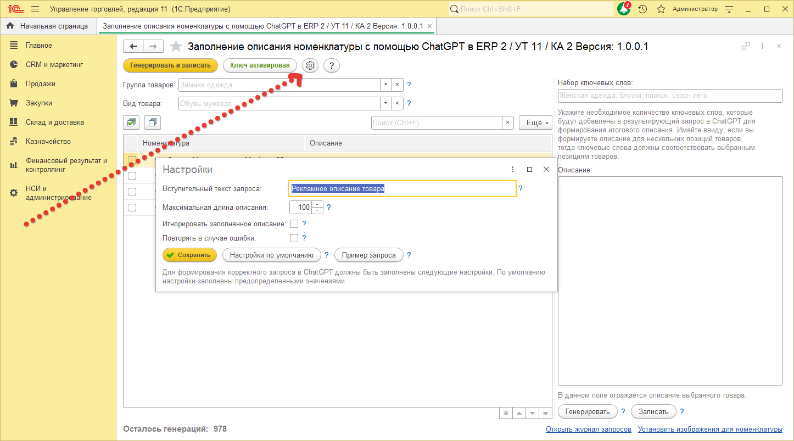

# Настройка

> Прежде чем начать работу, нужно просмотреть и при необходимости сделать настройки для генерации описаний. Для этого нужно нажать на кнопку с шестеренкой, после чего откроется окно для задания настроек.

> `Вступительный текст запроса`- данная строка будет стоять вначале запроса к ChatGPT и должна конкретизировать то, что в итоге мы хотим получить. Поэтому к написанию текста в ней нужно подойти обдуманно.  
> `Максимальная длина описания` -  из названия понятно, что данной настройкой ограничивается длина описания. Максимально возможной длиной описания является 500 символов - больше программа не позволит установить.  
> `Игнорировать` заполненное описание - позволяет игнорировать уже заполненное описание для обрабатываемой номенклатуры.   

Далее идут кнопки сохранения настроек, сброса настроек на настройки по- умолчанию и кнопка для демонстрации отправляемого запроса к ChatGPT.  

> `Повторять в случае ошибки` - в случае ошибки при первой генерации обработка сделает десять попыток с интервалом в десять секунд, после чего обработка прекратит работу. Если данный флаг не стоит, то при первой же неудачной попытке обработка прекращает свою работу.   
> Кнопка `Сохранить`- сохраняет произведенные настройки.  
> Кнопка `Настройки по умолчанию` - устанавливает настройки на те, которые были по- умолчанию.  
> Кнопка `Пример запроса` - выводит пример запроса который будет отправляться ChatGPT.  
 

