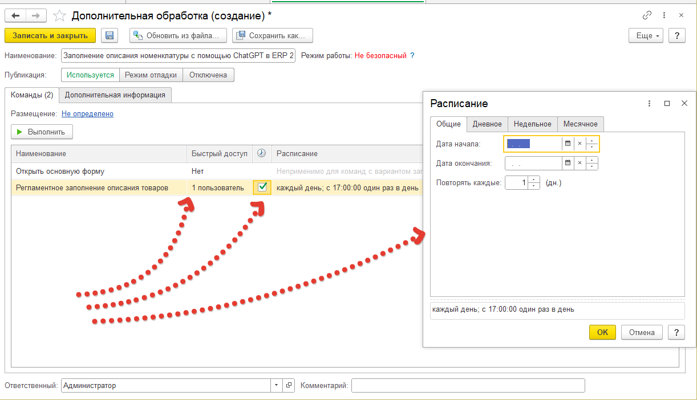
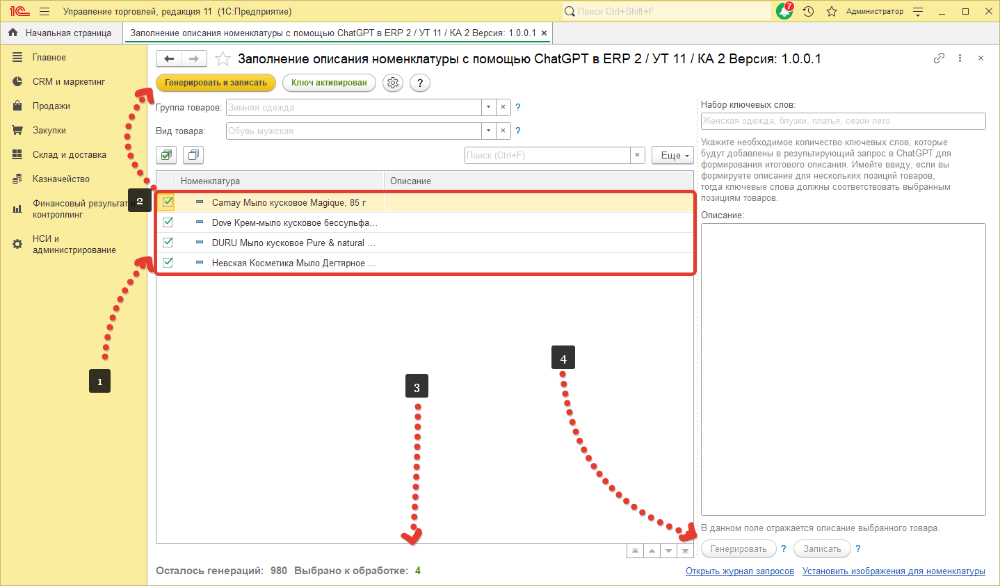
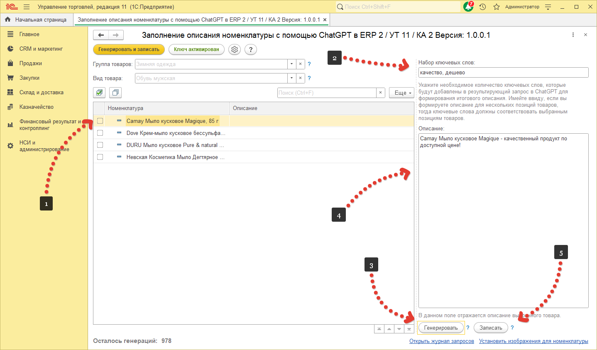

# Примеры работы с обработкой

Данная обработка поддерживает работу в фоновом режиме. Рассмотрим несколько примеров работы данной обработки.

## Запуск по расписанию.
Данный режим позволяет запускаться обработке по расписанию и заполнять описание в удобное время. Обработка будет работать со всей номенклатурой у которой нет описания, а так же если в настройках стоит флаг [`Игнорировать заполненное описание`](ПустаяСсылка) с уже заполненным описанием. Стоит учитывать, что при любой первой ошибке, обработка прекращает работу, чтобы не использовать генерации далее. Для запуска по расписанию достаточно настроить само расписание, перейдя в `НСИ и администрирование` далее `Дополнительные отчеты и обработки` и открыть установленную обработку(про установку можно прочитать тут). В данном окне указать пользователя и заполнить расписание.

## Генерировать и записать"
Следующий способ не менее прост. Нам нужно открыть окно обработки выбрать номенклатуру (1) и нажать кнопку `Генерировать и записать` (2). Вот в принципе и все. Обработка поддерживает работу в фоне, поэтому можно смело закрывать окно и продолжать работу в программе. Обратите внимание, что при установке флага для выбора номенклатуры кнопки `Генерировать` и `Записать`(4) становятся неактивны. Они активны когда не установлено ни одного флага. Так же возле информации с количеством генераций отображается количество отмеченной номенклатуры(3). 
!!! info
Обратите внимание что кнопки " Генерировать" и "Записать" неактивны если выделена флагом хотя бы одна номенклатура в списке слева.
!!!

Если нужно сгенерировать описание для одной номенклатуры, выделите номенклатуру в списке(1), установив на нее фокус, укажите при необходимости ключевые слова(2) и нажмите кнопку `Сгенерировать`(3). При необходимости отредактируйте сгенерированное описание(4) и нажмите на кнопку `Записать`(5).

