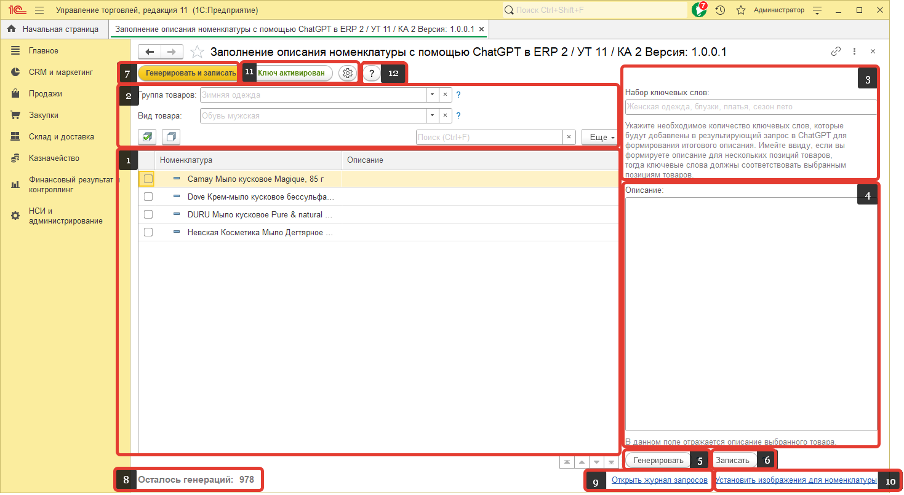

# Работа с обработкой

Рассмотрим окно для работы с обработкой.

1. Окно со списком номенклатуры. Слева от номенклатуры есть возможность отметить флагом, ту которую нужна для дальнейшей работы. Стоит отметить, что для групп номенклатуры, так же есть возможность отметить флагом, но описание для них не будет сгенерировано.
2. Данный блок позволяет производить поиск и фильтрацию номенклатуры.
3. Поле для ввода ключевых слов. Данные слова ChatGPT будет использовать в сгенерированном тесте.
4. Поле где будет отображаться сгенерированный текст описания.
5. Кнопка для генерации описания. После нажатия на кнопку текст будет сгенерирован, но добавлен к номенклатуре не будет. Генерироваться описание будет для номенклатуры, которая выделена в данный момент(установлен фокус), а не та которая отмечена флагом. Данная кнопка не активна при отметке флагом номенклатуры. 
6. После нажатия на данную кнопку, сгенерированный текст описания, с помощью предыдущей кнопки, будет добавлен к номенклатуре. Данная кнопка не активна при отметке флагом номенклатуры. 
7. Данная кнопка генерирует и сразу добавляет описание к номенклатуре. 
8. Показывает количество доступных генераций.
9. Гиперссылка открывающая страницу с историей запросов.
10. Гиперссылка, открывающая страницу с обработкой для установки картинок номенклатуре.
11. Кнопки для открытия окон активации обработки и настроек.
12. Кнопка для открытия данной документации.
