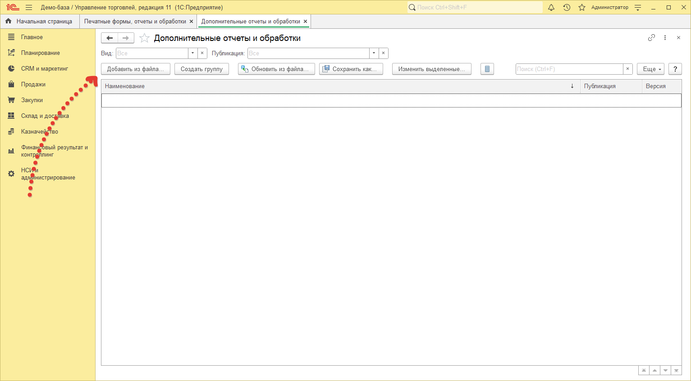

# Установка обработки

Для того, чтобы начать работать, достаточно открыть файл с обработкой через меню `Файл - Открыть`, однако данный режим не позволяет работать обработке по регламентному заданию. Установка не отличается от установки других обработок для типовых решений на платформе 1С. Рассмотрим установку на примере конфигурации «1С: Управление торговлей 11.5».

1. Для начала перейдем в раздел `НСИ и администрирование` и далее нажмем на гиперссылку `Дополнительные отчеты и обработки`. Если данная гиперссылка неактивна нужно установить соответствующий флаг левее от нее, который имеет такое же название.

2. В открывшемся окне нажимаем на кнопку `Добавить из файла`. В появившемся окне «Предупреждение безопасности» нажимаем на кнопку `Продолжить`, тем самым подтверждая, что мы уверены в содержимом файла, который хотим открыть. После чего, перед нами откроется окно выбора файла. Найдите файл с обработкой `ГенераторОписанияТоваров.epf` и выберите его, нажав на кнопку `Открыть` в нижнем левом углу окна, либо двойным щелчком левой клавиши мыши по нему. После чего перед нами откроется окно для добавления обработки.

3. Далее в строке `Размещение` нажмем гиперссылку `<не задано>` и выберем разделы для вызова обработки в открывшемся окне и нажмем `ОК`.

4. В столбце `Быстрый доступ` необходимо указать пользователей, которым будет видна команда для открытия обработки, и нажать `ОК`.

5. В окне подключения обработки нажимаем `Записать и закрыть`. На этом установка обработки в конфигурацию завершена.
